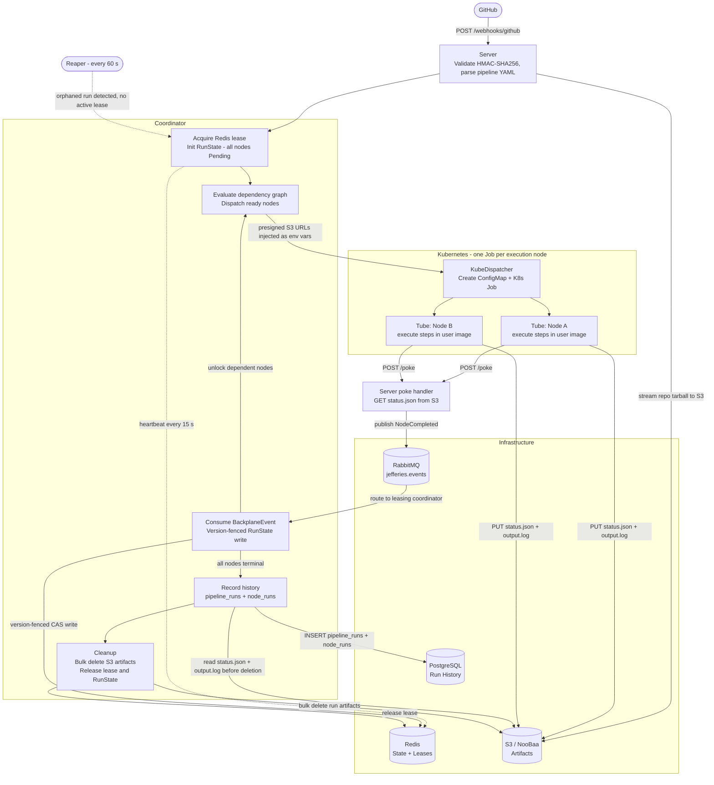

## **The Conn: Architecture Specification**

### **1. Core Philosophy**
* **Reactive & Distributed:** The system is a distributed state machine. Any server node in the cluster can progress a pipeline by interacting with the shared Redis state and RabbitMQ message backplane.
* **Stateless Ingress:** The **server** module is interchangeable. Traffic is balanced across replicas without losing track of active runs.
* **Resilient & Infrastructure-Blind:** The system assumes hardware and network failures. It self-heals via lease expiration and orphan reclamation, shielding the user from underlying instability.

---

### **2. Component & Module Breakdown**

#### **A. app_config (The Foundation)**
* **Layered Configuration:** Loads defaults from TOML and overrides them via environment variables using a double-underscore (`__`) separator for nested fields.
* **Secrets Management:** Handles sensitive credentials for **Redis**, **RabbitMQ**, **GitHub**, **S3/NooBaa**, and **PostgreSQL** injected via OpenShift SecretKeyRefs.

#### **B. providers (The Gatekeeper)**
* **GitHub Logic:** Contains the HMAC-SHA256 signature verification logic to ensure webhooks are authentic.
* **Repository Access:** Manages GitHub App authentication (JWT and Installation Tokens) to read `.jefferies/` YAML files directly from the source repository via the Contents API.

#### **C. pipelines (The Logic)**
* **Discovery:** Parses YAML to match incoming events (e.g., `push`) to specific execution plans.
* **State Schema:** Defines the `NodeInfo` and `Pipeline` types that feed into the `RunState` stored in **Redis**.

#### **D. state_store (The Global Memory)**
* **Persistent State:** Stores durable `RunState` (node statuses, dependency graph, full pipeline definition) in **Redis** at `jefferies:run:{run_id}:state`.
* **Version Fencing:** All writes use a Lua CAS script; a save is rejected unless the caller's expected version matches the stored version, preventing split-brain writes from zombie servers.
* **Distributed Leases:** Manages per-run lease keys in Redis with configurable TTLs. Leases carry a monotonically increasing version number and must be renewed via heartbeat.

#### **E. backplane (The Cluster-Wide Signal Bus)**
* **Event Pub/Sub:** A RabbitMQ topic exchange (`jefferies.events`) with per-run auto-delete queues decouples event producers from consumers across server instances.
* **Events:** `NodeCompleted { node_name, success }` and `Cancel` — replacing all in-process MPSC channels.
* **Stateless Delivery:** Any server replica can publish an event; the coordinator holding the lease for that run will receive it regardless of which physical node it runs on.

#### **F. coordinator (The Reactor)**
* **Distributed Lifecycle:** Acquires a **Lease** in Redis before starting; renews it via heartbeat every 15 seconds. If renewal fails, the coordinator stops gracefully to yield to a new leader.
* **Version-Fenced Writes:** Persists `RunState` to Redis after every node transition using optimistic concurrency. A rejected write (version conflict) causes the coordinator to stop immediately.
* **Event Handling:** Consumes `NodeCompleted` and `Cancel` messages from the backplane, updates in-memory state, and dispatches newly unlocked nodes.
* **The Reaper:** A background task that identifies orphaned runs (Running nodes in Redis but no active lease) and reclaims them by re-acquiring the lease and resuming from persisted state.
* **SourceManager:** Handles all S3/NooBaa interactions for a run. When a pipeline contains at least one node with `checkout: true`, the `SourceManager` streams the repository tarball directly from the GitHub API to S3 at `runs/{run_id}/source.tar.gz` before the coordinator starts — with no intermediate disk writes. It generates 12-hour presigned GET URLs for the source archive and presigned PUT URLs for per-node status payloads at `runs/{run_id}/nodes/{node_name}/status.json`. On run finalization, it issues a bulk delete of all objects under the `runs/{run_id}/` prefix.
* **KubeDispatcher:** The live `Dispatcher` implementation that actuates each pipeline node as a Kubernetes Job. It dispatches two distinct node kinds:
  * **Exec nodes** (`type: exec`, the default): run in `jefferies-jobs`. A `ConfigMap` is created containing the user-authored shell script (built from the node's `steps`), and a `Job` is submitted with an init container that copies the **Tube** binary to a shared `emptyDir` volume; the main container runs the user-provided image with `/shared/tube` as its entrypoint and all required `TUBE__` environment variables (presigned S3 URLs, poke callback URL, workspace config).
  * **Build nodes** (`type: build`): run in `jefferies-builder`, a dedicated namespace with a pre-provisioned `pipelines-sa-userid-1000` service account and `buildah-storage-config` ConfigMap. The script is system-generated as a single `buildah bud` invocation from the node's `config` block — users cannot supply arbitrary steps, which eliminates the security risk posed by the elevated capabilities buildah requires (`SETUID`, `SETGID`, `SETFCAP`). The merged init container (still using the Tube image) copies the Tube binary and sets up `/var/lib/containers` ownership before the main container starts; the main container runs `quay.io/buildah/stable:latest` with Tube as its entrypoint and the same lifecycle env vars as exec nodes.
  * Applies `the-conn.com/run-id` and `the-conn.com/managed-by: jefferies` labels to all created objects for tracking and bulk cleanup.
  * On cancellation, deletes Jobs and ConfigMaps from both namespaces.
  * The node image, Tube image, target namespace, builder namespace, and buildah image are all user-configurable in `[kubernetes]` of the TOML config.

#### **G. server (The Interface)**
* **Stateless Endpoints:** Axum handlers for GitHub webhooks and the secure status callbacks from **Tubes**.
* **Event Dispatch:** Validates requests and publishes the resulting state change to RabbitMQ, acting as the entry point for all external signals.

#### **H. run_history (The Audit Trail)**
* **PostgreSQL-backed persistence:** Records the outcome of every pipeline run and each of its constituent node runs in a relational schema, providing a durable history that survives beyond the lifetime of S3 artifacts and Redis state.
* **Schema:** `pipeline_runs` (UUID PK, pipeline YAML, trigger, owner/repo/SHA, `status` column with `in_progress`/`success`/`failure`/`cancelled`, timestamps) and `node_runs` (FK → pipeline run, node JSON definition, success flag, started/completed timestamps, output log). Only `cancelled` reflects an explicit user-initiated cancel via the API; fail-fast and timeout terminations are recorded as `failure`.
* **Insertion ordering:** The pipeline row is inserted before node rows to satisfy the FK constraint. `ON CONFLICT DO NOTHING` makes writes idempotent.
* **Recording window:** History is written by the coordinator immediately before `cleanup()` removes S3 artifacts, which is the only moment where node status files and output logs are still retrievable.
* **Live read augmentation:** While a run is active, the **server**'s node read endpoints transparently merge `status.json` and `output.log` from S3 on top of the Postgres row whenever `completed_at` is null, giving callers a near-live view of running nodes. After completion (and after cleanup), Postgres is the sole source of truth.
* **Test isolation:** A `NoOpRunHistory` implementation (no-op trait impl) is used in all in-process tests so no database is required at test time.

---

### **3. Data & Execution Flow**

1.  **Ingress:** A Webhook hits a **server** node. **providers** validates the signature and reads the pipeline YAML.
2.  **Source Upload:** If the pipeline has any node with `checkout: true`, **providers** calls the **SourceManager** to stream the repository tarball from GitHub directly to S3 at `runs/{run_id}/source.tar.gz` before the coordinator is started.
3.  **Initialization:** **coordinator** acquires a Redis lease and persists the initial `RunState`. All nodes with no dependencies are dispatched immediately. The **Dispatcher** uses the **SourceManager** to generate presigned URLs that are passed to each worker as environment variables.
4.  **Execution Loop:**
    * **Tubes** finishes a task and hits the **server** status endpoint.
    * The **server** publishes a `NodeCompleted` event to **RabbitMQ**.
    * The leasing **coordinator** reacts, updates the versioned Redis state, identifies "unlocked" nodes, and triggers the next Pods.
5.  **History Recording:** Before any cleanup, the coordinator reads each node's `status.json` (timestamps) and `output.log` from S3 via the dispatcher, then writes one row to `pipeline_runs` and one row per node to `node_runs` in PostgreSQL.
6.  **Cleanup:** After history is persisted, the coordinator calls the **SourceManager** to delete all S3 objects for the run, releases the lease, and deletes the run state from Redis.

#### **Execution Flow Diagram**

---

### **4. Resiliency & Error Handling**

| Scenario | System Response |
| :--- | :--- |
| **Server Instance Failure** | The Redis **Lease** TTL expires. The **Reaper** detects the orphaned run and re-acquires the lease on a healthy node. |
| **Network Partition / Zombie Server** | **Fencing Tokens** ensure that a zombie server cannot write outdated state to Redis once a new coordinator has established a higher-version lease. |
| **Worker Pod Failure** | **Tubes** reports a `Fail` status. The **coordinator** marks the node as failed and, if `fail_fast` is enabled, cancels the pipeline. |
| **Node Deletion** | A K8s Watcher in the background detects the missing Pod; the **coordinator** reconciles the state and marks it as a system error. |
| **Version Conflict** | The `state_store` rejects the write. The coordinator stops immediately to avoid split-brain execution. |

---

### **5. Key Operational Concepts**
* **Externalized State:** No local RAM or disk is used for run-time data. Redis and RabbitMQ provide the cluster's "shared brain."
* **Idempotent Dispatch:** Before starting a Pod, the system checks OpenShift to ensure a Pod for that `RunID/Step` doesn't already exist.
* **Rehydration:** Any **coordinator** can resume any pipeline by reading the current `RunState` snapshot from Redis, ensuring zero downtime during rolling updates of the backend.
