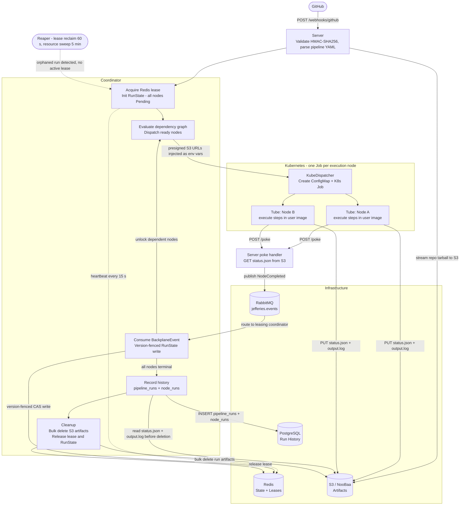

## **The Conn: Architecture Specification**

### **1. Core Philosophy**
* **Reactive & Distributed:** The system is a distributed state machine. Any server node in the cluster can progress a pipeline by interacting with the shared Redis state and RabbitMQ message backplane.
* **Stateless Ingress:** The **server** module is interchangeable. Traffic is balanced across replicas without losing track of active runs.
* **Resilient & Infrastructure-Blind:** The system assumes hardware and network failures. It self-heals via lease expiration and orphan reclamation, shielding the user from underlying instability.

---

### **2. Component & Module Breakdown**

#### **A. app_config (The Foundation)**
* **Layered Configuration:** Loads defaults from TOML and overrides them via environment variables using a double-underscore (`__`) separator for nested fields.
* **Secrets Management:** Handles sensitive credentials for **Redis**, **RabbitMQ**, **S3/NooBaa**, and **PostgreSQL** injected via OpenShift SecretKeyRefs. Per-tenant GitHub App credentials live in **tenancy** instead, mounted via Vault.

#### **A'. tenancy (The Multi-Tenant Provider Registry)**
* **Composed Document:** Loads a YAML document from a Vault-mounted file (default `/etc/jefferies/tenancy/tenants.yaml`, overridable via `JEFFERIES__TENANCY__PATH`) with two top-level lists: `github_apps` (operator-owned GitHub App credentials) and `tenants` (logical tenants that reference an app and a Dex connector).
* **GithubAppRegistry:** Each `github_apps` entry carries an `id` plus the GitHub App's `app_id`, `webhook_secret`, and `private_key`. Multiple tenants reference the same `id` to share a single App without duplicating credentials.
* **TenantRegistry:** Each tenant entry carries a `slug`, optional `display_name`, a `connector_ids` list of trusted Dex connector ids, and a `provider: github` block with `org_name` (the GitHub organization login, decoupled from `slug`) and `github_app` (the `id` of the App that serves this org). The serde-tagged `provider` discriminator reserves the schema for future providers (`gitlab`, etc.) without breaking existing entries.
* **Webhook Routing (HMAC-Trial):** Webhooks arrive at `/webhooks/github` (a single endpoint shared by all tenants and Apps — required because each App funnels its events through one URL). The backend identifies the source App by trying each configured `github_apps[].webhook_secret` against the request's `X-Hub-Signature-256`; the App whose constant-time HMAC verification succeeds is the source. A signature that verifies under no App is rejected with 401. After identification, the owner login + type are extracted from the body (`repository.owner.{login,type}`, `organization.login`, or `installation.account.{login,type}`); non-Organization owners are dropped, and the tenant is resolved by `(github_app, org_name) → TenantConfig`. A verified webhook for an org not registered under that App is dropped with 200. Run records persist `tenant_slug` so retries can re-resolve the tenant after a pod restart.
* **Validation at Load:** App `id` and tenant `slug` are restricted to lowercase alnum + `-`, max 63 chars, must start alnum, and must be unique. `org_name` follows GitHub's org-login rules: alnum + `-`, max 39 chars, no leading hyphen. Each tenant's `github_app` must reference an existing App; `(github_app, org_name)` and `(connector_id, org_name)` must each be unique across tenants. `connector_ids` must be non-empty. Bad config fails the pod fast at startup.
* **Out of Scope (Today):** Hot-reload of the tenancy file, per-tenant Vault role automation, and per-tenant `state_store` / `backplane` key namespacing.

#### **A''. auth (Human Authentication via Dex)**
* **OIDC Client:** At startup, fetches Dex's OIDC discovery document from `JEFFERIES__DEX__ISSUER` (one URL — used for both discovery and JWKS validation; the deployment makes that URL reachable from the backend pod). Builds a `CoreClient` with the configured client_id, secret, and `JEFFERIES__DEX__REDIRECT_URI`.
* **Login Flow:** `GET /api/auth/login` generates state + PKCE + nonce, persists them in a server-side session record, and 302-redirects to Dex with scopes `openid profile email groups federated:id` (the `federated:id` scope is what makes Dex include `federated_claims.connector_id` in the ID token). Dex authenticates the user via the appropriate connector and 302-redirects to `GET /api/auth/callback`, which verifies state, exchanges the code (with PKCE), validates the ID token, and reads two claims: `groups` (org logins, optionally `:team`-suffixed) and `federated_claims.connector_id` (the Dex connector that vouched for this login).
* **Connector-Bound Tenant Mapping:** For each org parsed from `groups`, the callback looks up a tenant by `(connector_id, org_name)`. A tenant is authorized only if its `connector_ids` list contains the JWT's `connector_id`; otherwise it is silently filtered out, even if the org login matches. This binding prevents a user authenticated through one connector (e.g. `github-global`) from being granted access to a tenant intended to be reached only through a different connector (e.g. a dedicated `github-acme` App on a separate GHES instance whose org happens to share the same name). Empty result → 403 `no_authorized_tenants`. Non-empty → a fresh `AuthSession { user_id, email, name, authorized_slugs, active_tenant_context }` is stored in the session with `active_tenant_context` defaulted to the first matched slug.
* **Sessions:** Backed by the same Redis instance the rest of the backend uses, accessed via `tower-sessions-redis-store` (a separate `fred` pool from `state_store`'s deadpool). Cookies are HttpOnly, Secure, SameSite=Lax, with a 7-day inactivity expiry.
* **Authorization Extractor:** `AuthorizedTenant` reads the `:slug` path param, loads the session's `AuthSession`, and short-circuits with 401 if no session or 403 if the slug isn't in `authorized_slugs`. Applied as a per-route layer on every `/api/{slug}/...` route.
* **Data Scope:** Every protected handler additionally enforces that the data it returns belongs to the URL slug — `list_runs` filters by `owner == slug`, the per-run handlers (`get_run`, `get_run_status`, `list_run_nodes`, `get_run_node`, `get_node_log`, `cancel`, `retry`) verify the run's `tenant_slug` matches and return 404 if it doesn't. The auth layer prevents access from outside; the data scope check prevents bleed-through within an authorized session.
* **Public Routes:** `GET /health/{live,ready}`, `POST /webhooks/github`, and the Tube callback `POST /api/v1/runs/{run_id}/nodes/{node_name}/poke` bypass session and auth — they are not human-facing and use their own authentication mechanisms (HMAC for webhooks; the Tube callback is reachable only from in-cluster Job pods).
* **Out of Scope:** Token refresh (the user re-authenticates via `/api/auth/login` when the session expires), per-tenant fine-grained roles (membership in the GitHub org is the only authorization check), automatic onboarding of orgs that install the App but aren't in `tenants.yaml`.

#### **B. providers (The Gatekeeper)**
* **GitHub Logic:** Performs HMAC-SHA256 verification against every configured GitHub App's `webhook_secret` (constant-time, via `mac.verify_slice`). The App whose secret verifies the signature identifies the source; the tenant is then resolved by `(github_app, owner_login)` from the **tenancy** registry. Signatures that verify under no App are 401; verified signatures targeting an org not registered under that App are dropped with 200.
* **Repository Access:** Manages GitHub App authentication (JWT and Installation Tokens) using the resolved App's `app_id` + `private_key` to read `.jefferies/` YAML files directly from the source repository via the Contents API.

#### **C. pipelines (The Logic)**
* **Discovery:** Parses YAML to match incoming events (e.g., `push`) to specific execution plans.
* **State Schema:** Defines the `NodeInfo` and `Pipeline` types that feed into the `RunState` stored in **Redis**.

#### **D. state_store (The Global Memory)**
* **Persistent State:** Stores durable `RunState` (node statuses, dependency graph, full pipeline definition) in **Redis** at `jefferies:run:{run_id}:state`.
* **Version Fencing:** All writes use a Lua CAS script; a save is rejected unless the caller's expected version matches the stored version, preventing split-brain writes from zombie servers.
* **Distributed Leases:** Manages per-run lease keys in Redis with configurable TTLs. Leases carry a monotonically increasing version number and must be renewed via heartbeat.

#### **E. backplane (The Cluster-Wide Signal Bus)**
* **Event Pub/Sub:** A RabbitMQ topic exchange (`jefferies.events`) with per-run auto-delete queues decouples event producers from consumers across server instances.
* **Events:** `NodeCompleted { node_name, success }` and `Cancel` — replacing all in-process MPSC channels.
* **Stateless Delivery:** Any server replica can publish an event; the coordinator holding the lease for that run will receive it regardless of which physical node it runs on.

#### **F. coordinator (The Reactor)**
* **Distributed Lifecycle:** Acquires a **Lease** in Redis before starting; renews it via heartbeat every 15 seconds. If renewal fails, the coordinator stops gracefully to yield to a new leader.
* **Version-Fenced Writes:** Persists `RunState` to Redis after every node transition using optimistic concurrency. A rejected write (version conflict) causes the coordinator to stop immediately.
* **Event Handling:** Consumes `NodeCompleted` and `Cancel` messages from the backplane, updates in-memory state, and dispatches newly unlocked nodes.
* **The Reaper:** A background task with two cadences. Every **60 seconds** it scans Redis for runs with active in-flight nodes but no active lease and reclaims them by re-acquiring the lease and resuming from persisted state. Every **5 minutes** it runs a resource sweep that handles incomplete cleanup: any Redis run state that is unleased and fully terminal (no `Running` nodes, no dispatchable `Pending` nodes) gets `dispatcher.cleanup_run` plus `release_lease` plus `delete_run`; any Kubernetes Job labeled `the-conn.com/managed-by=jefferies` whose `run-id` no longer has Redis state gets `dispatcher.cleanup_run` to remove the stranded Jobs and ConfigMaps across both namespaces.
* **SourceManager:** Handles all S3/NooBaa interactions for a run. When a pipeline contains at least one node with `checkout: true`, the `SourceManager` streams the repository tarball directly from the GitHub API to S3 at `runs/{run_id}/source.tar.gz` before the coordinator starts — with no intermediate disk writes. It generates 12-hour presigned GET URLs for the source archive and presigned PUT URLs for per-node status payloads at `runs/{run_id}/nodes/{node_name}/status.json`. On run finalization, it issues a bulk delete of all objects under the `runs/{run_id}/` prefix.
* **KubeDispatcher:** The live `Dispatcher` implementation that actuates each pipeline node as a Kubernetes Job. There is a single node template — every node, regardless of workload, runs under the same shape:
  * **Conditional sandboxing on `privileged`:** non-privileged nodes run on the cluster's default runtime under `serviceAccountName: jefferies-jobs-default`, which keeps IO-heavy workloads (Rust compilation, `cargo test`, etc.) on the fast path and avoids the kata performance overhead. Privileged nodes (`privileged: true`) are submitted with `runtimeClassName: kata` and `serviceAccountName: jefferies-jobs-privileged` so VM-level isolation is in place before any host-breaking primitive (overlay mounts, `--network=host`, `buildah bud`) is exposed. Only the kata-paired SA is bound to a privileged SCC; the default SA stays restricted. Both SAs are bound to the cluster's Vault Kubernetes auth role so the Vault Agent Injector can fetch per-run secrets at init time.
  * **Single namespace:** all Jobs land in `jefferies-jobs`. The previous `jefferies-builder` namespace, `pipelines-sa-userid-1000` SA, and `buildah-storage-config` ConfigMap are gone.
  * **Pod construction:** a `ConfigMap` is created containing the user-authored shell script (built from the node's `steps`), and a `Job` is submitted with an init container that copies the **Tube** binary to a shared `emptyDir`; the main container runs the user-provided image with `/shared/tube` as its entrypoint and all required `TUBE__` environment variables (presigned S3 URLs, poke callback URL, workspace config).
  * **Per-node user knobs** (all optional, mapped 1:1 from YAML to the Pod spec):
    * `privileged: true` sets `securityContext.privileged` on the user container — useful for inner builds (buildah, docker-in-docker) that need to mount overlay filesystems. The init container always stays unprivileged. Setting `privileged: true` also flips the Pod into the kata sandbox under `jefferies-jobs-sa`; non-privileged nodes use the cluster's default runtime and SA for full performance.
    * `cache_size: <quantity>` adds a `Volume { emptyDir { medium: Memory, sizeLimit } }` and mounts it at `/tmp/cache`. The user is responsible for pointing tools (`CARGO_HOME`, `PIP_CACHE_DIR`, `npm config set cache`, etc.) at that path. The workspace itself (mounted at `/workspace`) is a plain disk-backed `emptyDir` — putting it in tmpfs charges checkout/build artifacts against the pod's memory cgroup and tends to OOM under realistic build loads, especially outside the kata guest.
    * `volumes: { <name>: <mount_path>, ... }` declares additional disk-backed `emptyDir` volumes mounted into the user container. Useful for tools that need a writable filesystem at a specific path — e.g. `var-lib-containers: /var/lib/containers` so `buildah` can stage its overlay store. Each name must be a valid DNS-1123 label, must not collide with the reserved internal names (`tube-bin`, `workspace`, `user-script`, `cache`), and the mount path must be absolute and must not overlap any reserved internal mount (`/shared`, `/workspace`, `/etc/conn`, `/tmp/cache`). Two volumes on the same node cannot share a mount path.
    * `cpu` / `memory` are written to **both** `requests` and `limits` for deterministic sizing. Unset values fall back to `kubernetes.default_cpu` / `kubernetes.default_memory` (1 vCPU / 2Gi by default). For kata-sandboxed (privileged) nodes the Pod runs inside a fixed-size guest VM, so matching requests==limits keeps the scheduler honest; for non-kata nodes it still gives deterministic capacity planning.
  * Applies `the-conn.com/run-id`, `the-conn.com/node-name`, and `the-conn.com/managed-by: jefferies` labels to all created objects for tracking, bulk cleanup, and `PodWatcher` routing.
  * On cancellation and on full-run cleanup, deletes Jobs and ConfigMaps from `jefferies-jobs` (the `Reaper` calls the same path to mop up resources for runs whose Redis state has already been removed).
  * Sets the K8s Job `activeDeadlineSeconds` to `startup_timeout + runtime_timeout + 60s` as an outer safety net so a permanently-dead coordinator cannot leave Pods running indefinitely.
  * **Vault secret injection:** the YAML accepts a structured `secrets:` block at both the pipeline and node levels (node-level wins on per-name conflicts, mirroring the existing `env` merge). Two flavors:
    * `secrets.env: [NAME, ...]` — names a secret to render at `/etc/tube/secrets/env/<NAME>`. The Tube binary reads that directory and exposes each file as an env var to the user script with values masked in captured logs.
    * `secrets.files: [NAME, ... or {name, path}]` — bare names render at `/etc/tube/secrets/files/<NAME>`; entries with an absolute `path` render to that exact location (e.g. `/etc/pki/ca-trust/source/anchors/proxy.crt`).
    Each secret resolves from `secret/data/<owner>__<repo>` (no org-level fallback) — the same `<owner>__<repo>` slug used for the Vault role binding, so the path, role, and any future per-repo policy line up by visual inspection. The Pod template carries four global annotations (`vault.hashicorp.com/agent-inject`, `agent-pre-populate-only`, `secret-volume-path: /etc/tube/secrets`, `role`) plus a per-secret triple `(agent-inject-secret-<id>, agent-inject-template-<id>, agent-inject-file-<id>)` keyed by `env-<NAME>` or `file-<NAME>`. File secrets with a custom path also emit `secret-volume-path-<id>` to redirect that single rendered file outside the default volume.
  * The node image, Tube image, target namespace, privileged + default service accounts, runtime class, and default CPU/memory are all user-configurable in `[kubernetes]` of the TOML config. The Vault role bound on each Pod is derived per-repo as `<owner>__<repo>` — the `__` separator is valid in Vault role names but disallowed in owner namespaces across GitHub, GitLab, and Bitbucket, so the slug is unambiguous and a Vault admin can grant per-repo access without sanitization headaches.

#### **G. server (The Interface)**
* **Stateless Endpoints:** Axum handlers for GitHub webhooks and the secure status callbacks from **Tubes**.
* **Event Dispatch:** Validates requests and publishes the resulting state change to RabbitMQ, acting as the entry point for all external signals.

#### **H. run_history (The Audit Trail)**
* **PostgreSQL-backed persistence:** Records the outcome of every pipeline run and each of its constituent node runs in a relational schema, providing a durable history that survives beyond the lifetime of S3 artifacts and Redis state.
* **Schema:** `pipeline_runs` (UUID PK, pipeline YAML, trigger, owner/repo/SHA, `status` column with `in_progress`/`success`/`failure`/`cancelled`, timestamps) and `node_runs` (FK → pipeline run, node JSON definition, success flag, started/completed timestamps, output log). Only `cancelled` reflects an explicit user-initiated cancel via the API; fail-fast and timeout terminations are recorded as `failure`.
* **Insertion ordering:** The pipeline row is inserted before node rows to satisfy the FK constraint. `ON CONFLICT DO NOTHING` makes writes idempotent.
* **Recording window:** History is written by the coordinator immediately before `cleanup()` removes S3 artifacts, which is the only moment where node status files and output logs are still retrievable.
* **Live read augmentation:** While a run is active, the **server**'s node read endpoints transparently merge `status.json` and `output.log` from S3 on top of the Postgres row whenever `completed_at` is null, giving callers a near-live view of running nodes. After completion (and after cleanup), Postgres is the sole source of truth.
* **Test isolation:** A `NoOpRunHistory` implementation (no-op trait impl) is used in all in-process tests so no database is required at test time.

---

### **3. Data & Execution Flow**

1.  **Ingress:** A Webhook hits a **server** node at `/webhooks/github`. **providers** identifies the source GitHub App by HMAC-trial against every configured App's `webhook_secret`, extracts the owner login from the payload, resolves the tenant via the **tenancy** registry by `(github_app, owner_login)`, and reads the pipeline YAML using that App's installation token.
2.  **Source Upload:** If the pipeline has any node with `checkout: true`, **providers** calls the **SourceManager** to stream the repository tarball from GitHub directly to S3 at `runs/{run_id}/source.tar.gz` before the coordinator is started.
3.  **Initialization:** **coordinator** acquires a Redis lease and persists the initial `RunState`. All nodes with no dependencies are dispatched immediately. The **Dispatcher** uses the **SourceManager** to generate presigned URLs that are passed to each worker as environment variables.
4.  **Execution Loop:**
    * **Tubes** finishes a task and hits the **server** status endpoint.
    * The **server** publishes a `NodeCompleted` event to **RabbitMQ**.
    * The leasing **coordinator** reacts, updates the versioned Redis state, identifies "unlocked" nodes, and triggers the next Pods.
5.  **History Recording:** Before any cleanup, the coordinator reads each node's `status.json` (timestamps) and `output.log` from S3 via the dispatcher, then writes one row to `pipeline_runs` and one row per node to `node_runs` in PostgreSQL.
6.  **Cleanup:** After history is persisted, the coordinator calls the **SourceManager** to delete all S3 objects for the run, releases the lease, and deletes the run state from Redis.

#### **Execution Flow Diagram**

---

### **4. Resiliency & Error Handling**

| Scenario | System Response |
| :--- | :--- |
| **Server Instance Failure** | The Redis **Lease** TTL expires. The **Reaper** detects the orphaned run and re-acquires the lease on a healthy node. |
| **Network Partition / Zombie Server** | **Fencing Tokens** ensure that a zombie server cannot write outdated state to Redis once a new coordinator has established a higher-version lease. |
| **Worker Pod Failure** | **Tubes** reports a `Fail` status. The **coordinator** marks the node as failed and, if `fail_fast` is enabled, cancels the pipeline. |
| **Infrastructure Failure** | A per-run **PodWatcher** observes Pod conditions via `kube::runtime::watcher` and emits a structured `InfraFailureReason` (e.g. `ImagePullFailed`, `OOMKilled`, `ContainerCreateError`, `InitContainerFailed`, `PodDeletedUnexpectedly`) the moment K8s reports it, so the coordinator can fail-fast without waiting for the runtime timeout. The reason's `stable_code` is persisted to `node_runs.failure_reason`; the API surfaces a curated `user_message` for actionable causes (image pull, OOM, container-config errors, startup timeout). Non-actionable causes are logged structurally on the backend only. |
| **Pod Stuck Pending** | The coordinator splits the per-node timer into a **startup phase** (Job creation → main container `Running`, default 300s) and a **runtime phase** (default 600s). Resource pressure or slow image pulls fail with `PodStartTimeout` rather than consuming the runtime budget. K8s `activeDeadlineSeconds` is set to `startup + runtime + 60s` as an outer safety net. |
| **Stranded Resources After Failed Cleanup** | If a coordinator's `cleanup()` partially fails (e.g., Redis state gets deleted but a K8s API call fails, or vice versa), the **Reaper**'s 5-minute sweep reconciles: terminal-and-unleased Redis state triggers `cleanup_run` + `delete_run`; orphan K8s Jobs whose `run-id` has no Redis state trigger `cleanup_run`. Both passes are idempotent. |
| **Version Conflict** | The `state_store` rejects the write. The coordinator stops immediately to avoid split-brain execution. |

---

### **5. Key Operational Concepts**
* **Externalized State:** No local RAM or disk is used for run-time data. Redis and RabbitMQ provide the cluster's "shared brain."
* **Idempotent Dispatch:** Before starting a Pod, the system checks OpenShift to ensure a Pod for that `RunID/Step` doesn't already exist.
* **Rehydration:** Any **coordinator** can resume any pipeline by reading the current `RunState` snapshot from Redis, ensuring zero downtime during rolling updates of the backend.
